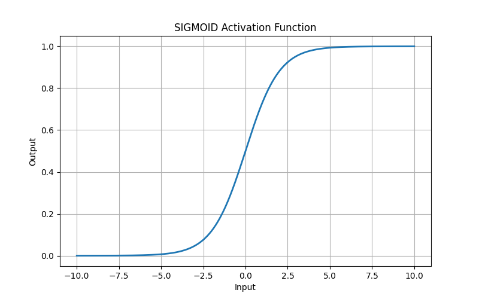
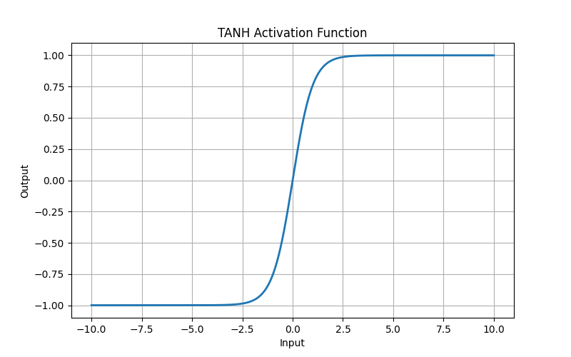
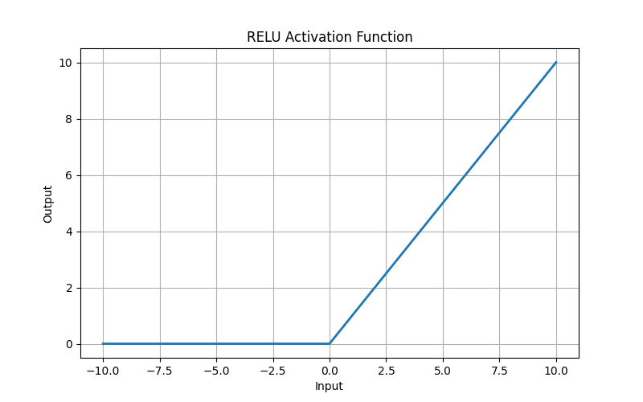
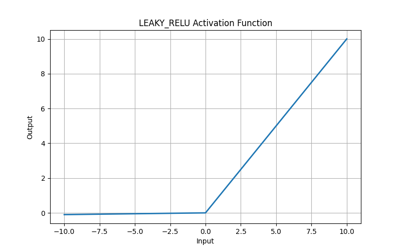
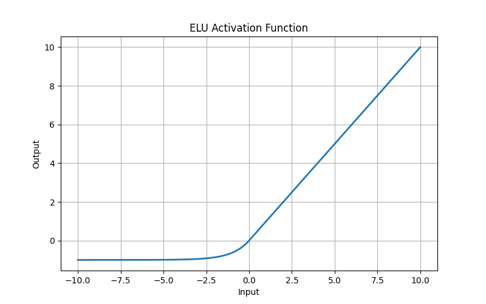
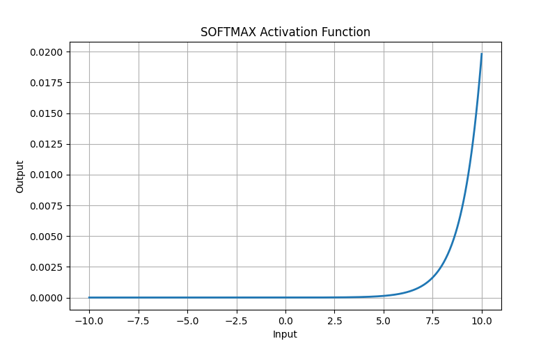
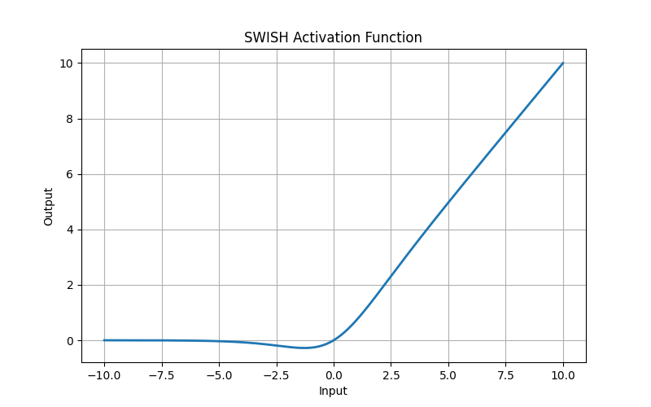
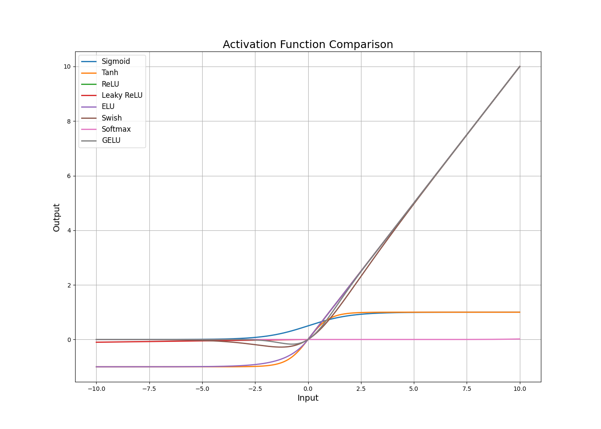

# Activation Functions for Neural Network in Python


## Overview

This project demonstrates the most important activation functions used in Deep Learning and Neural Networks using Python.
It provides:

* Mathematical explanations
* Visual plots of activation functions
* Advantages and disadvantages
* Typical use cases
* Python implementations
* Comparative analysis

---

# GitHub Repository Structure

```text
activation-functions-python/
│
├── README.md
├── requirements.txt
├── LICENSE
├── .gitignore
│
├── images/
│   ├── sigmoid.png
│   ├── tanh.png
│   ├── relu.png
│   ├── leaky_relu.png
│   ├── elu.png
│   ├── softmax.png
│   ├── swish.png
│   └── gelu.png
│
├── src/
│   ├── plot_functions.py
│   ├── activation_functions.py
│   └── utils.py
│
├── notebooks/
│   ├── activation_visualization.ipynb
│   └── activation_comparison.ipynb
│
├── examples/
│   ├── tensorflow_example.py
│   └── tensorflow_cnn_example.py
│   └──tensorflow_transformer_gelu.py

```

---

## Installation

```bash
pip install -r requirements.txt
```

---

## Generate Activation Function Plots

```bash
python src/plot_functions.py
```

---

# Activation Functions

## 1. Sigmoid



### Formula

```math
σ(x) = \frac{1}{1 + e^{-x}}
```

### Advantages

* Smooth gradient
* Outputs values between 0 and 1
* Good for probability estimation

### Disadvantages

* Vanishing gradient problem
* Slow convergence
* Not zero-centered

### Common Uses

* Binary classification output layers
* Logistic regression
* Probability prediction

---

## 2. Tanh



### Formula

```math
tanh(x) = \frac{e^x - e^{-x}}{e^x + e^{-x}}
```

### Advantages

* Zero-centered output
* Stronger gradients than sigmoid
* Better convergence in hidden layers

### Disadvantages

* Still suffers from vanishing gradients
* Computationally expensive

### Common Uses

* Hidden layers in RNNs
* Sequence modeling
* NLP tasks

---

## 3. ReLU



### Formula

```math
ReLU(x) = max(0, x)
```

### Advantages

* Fast computation
* Efficient training
* Reduces vanishing gradient issues

### Disadvantages

* Dying ReLU problem
* Outputs only positive values

### Common Uses

* CNNs
* Deep neural networks
* Computer vision

---

## 4. Leaky ReLU



### Formula

```math
f(x) = max(0.01x, x)
```

### Advantages

* Prevents dying ReLU
* Better gradient flow
* Improves training stability

### Disadvantages

* Requires tuning alpha parameter
* Slightly more computationally expensive

### Common Uses

* Deep CNNs
* GANs
* Large-scale neural networks

---

## 5. ELU



### Formula

```math
ELU(x) =
\begin{cases}
x & x > 0 \\
α(e^x - 1) & x \leq 0
\end{cases}
```

### Advantages

* Faster convergence
* Handles negative values well
* Reduces bias shift

### Disadvantages

* More computationally expensive than ReLU
* Requires alpha tuning

### Common Uses

* Deep learning architectures
* Image classification
* Networks requiring fast convergence

---

## 6. Softmax



### Formula

```math
Softmax(x_i) = \frac{e^{x_i}}{\sum_j e^{x_j}}
```

### Advantages

* Produces probability distribution
* Ideal for multi-class classification
* Easy interpretation

### Disadvantages

* Sensitive to large values
* Computationally expensive for many classes

### Common Uses

* Multi-class classification
* Output layers in classifiers
* NLP models

---

## 7. Swish



### Formula

```math
Swish(x) = x * sigmoid(x)
```

### Advantages

* Smooth non-linearity
* Better performance in deep networks
* Improved gradient flow

### Disadvantages

* More computationally expensive than ReLU
* Less interpretable

### Common Uses

* EfficientNet architectures
* Advanced CNNs
* Research models

---

## 8. GELU


### Formula

```math
GELU(x) = x * Φ(x)
```

### Advantages

* Smooth activation
* Excellent performance in transformers
* Better probabilistic behavior

### Disadvantages

* Computationally expensive
* More complex implementation

### Common Uses

* Transformer models
* BERT
* GPT architectures

---

# Activation Function Comparison

| Activation | Output Range | Vanishing Gradient | Computational Cost | Best Use Case |
|---|---|---|---|---|
| Sigmoid | 0 to 1 | High | Medium | Binary classification |
| Tanh | -1 to 1 | High | Medium | RNN hidden layers |
| ReLU | 0 to ∞ | Low | Low | CNNs and deep networks |
| Leaky ReLU | -∞ to ∞ | Low | Low | GANs and deep CNNs |
| ELU | -α to ∞ | Low | Medium | Faster convergence |
| Swish | -∞ to ∞ | Very Low | Medium | EfficientNet |
| GELU | -∞ to ∞ | Very Low | High | Transformers |
| Softmax | 0 to 1 | N/A | High | Multi-class classification |



---

# Technologies Used

* Python
* NumPy
* Matplotlib
* TensorFlow
* PyTorch

---

# License

MIT License